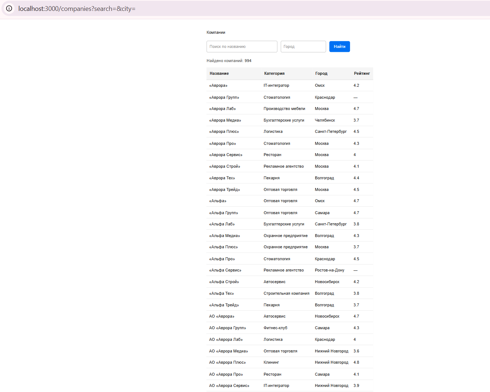
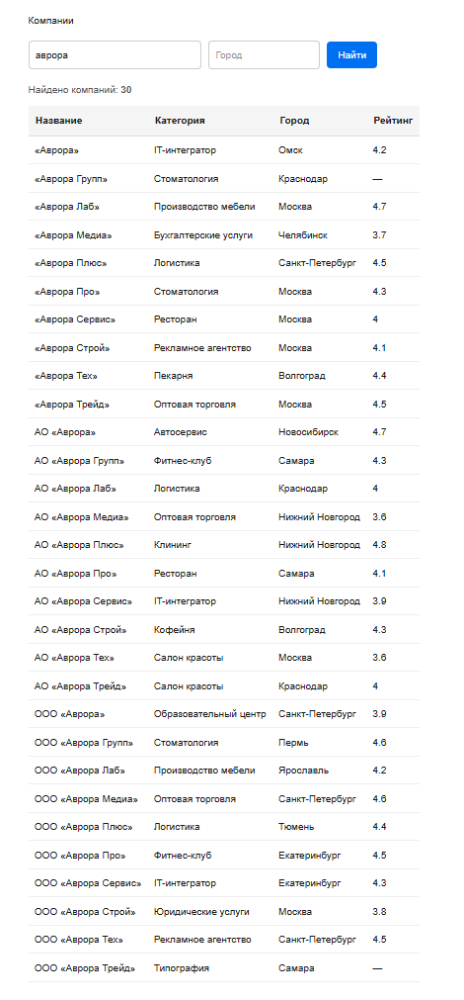
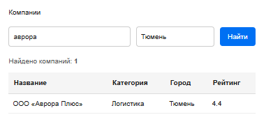
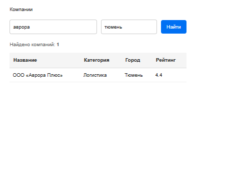
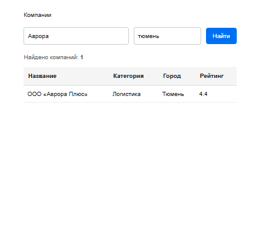
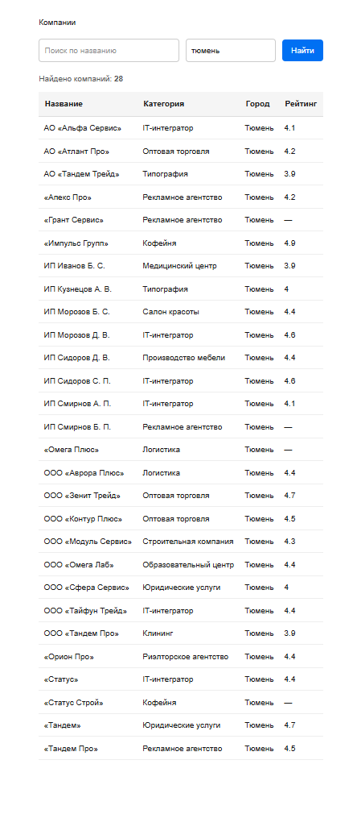

# SQL Test Task

## Стек

- Node.js
- TypeScript
- PostgreSQL
- Docker
- Next.js (App Router)

## Структура проекта

```
ai/
│
├── database/
│   ├── data/
│   ├── src/
│   │   ├── db.ts
│   │   ├── load.ts
│   │   ├── loadReviews.ts
│   │   └── ...
│   ├── schema.sql
│   ├── queries.sql
│   ├── docker-compose.yml
│   └── package.json
│
├── companies-app/
│   ├── app/
│   ├── package.json
│   └── ...
│
├── README.md
└── ANOMALIES.md
```

---

# Задача 1. Загрузка данных в PostgreSQL

## 1. Установить зависимости

```bash
cd database
npm install
```

## 2. Запустить PostgreSQL

```bash
docker compose up -d
```

## 3. Создать таблицы

```bash
Get-Content schema.sql | docker exec -i companies-db psql -U postgres -d companies
```

## 4. Загрузить данные

```bash
npm run load
```

## 5. Выполнить SQL-запросы

```bash
docker cp queries.sql companies-db:/queries.sql
docker exec companies-db psql -U postgres -d companies -f /queries.sql
```

### Особенности

- используется PostgreSQL;
- реализована дедупликация по `id`;
- созданы индексы для ускорения поиска по категориям, городам и рейтингу;
- загрузка выполняется из всех файлов `page_001.json` – `page_020.json`.

При загрузке используется дедупликация по полю `id` (`PRIMARY KEY` + `ON CONFLICT DO NOTHING`), поэтому в базе сохраняются только уникальные записи.

---

# Задача 2. Next.js

## Запуск

Перейти в папку приложения

```bash
cd companies-app
```

Установить зависимости

```bash
npm install
```

Запустить приложение

```bash
npm run dev
```

После запуска страница доступна по адресу

```
http://localhost:3000/companies
```

### Возможности

- просмотр списка компаний;
- поиск по названию;
- фильтрация по городу;
- данные загружаются сервером напрямую из PostgreSQL (Server Component);
- параметры поиска передаются через URL (`searchParams`).

## Проверка работы

Во время проверки были выполнены следующие действия:

- проверена загрузка списка компаний из базы данных;
- проверен поиск по названию компании;
- проверена фильтрация по городам;
- проверена совместная работа поиска и фильтра;
- проверена работа при пустом результате поиска.

Во время разработки возникли проблемы с подключением к PostgreSQL из-за использования неправильного порта и локального экземпляра PostgreSQL вместо Docker-контейнера. После изменения порта и настройки переменной окружения `DATABASE_URL` приложение успешно подключилось к базе данных.

### Скриншоты













---

# Задача 3. Анализ review.csv

## Загрузка данных

Перейти в папку базы данных

```bash
cd database
```

Запустить импорт

```bash
npm run load:reviews
```

Во время выполнения скрипт:

- импортирует данные из `review.csv`;
- загружает их во временную таблицу `review_import`;
- сравнивает данные с основной таблицей `companies`;
- выводит найденные аномалии.

Подробный список обнаруженных проблем приведён в файле **ANOMALIES.md**.